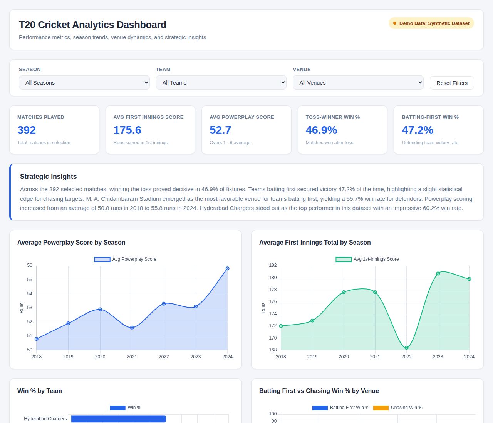

# T20 Cricket Analytics Dashboard

An interactive, responsive static analytics dashboard built to visualize T20 cricket performance metrics, historical season trends, venue dynamics, team win percentages, and dynamic automated insights.



## Features

- **Dynamic Filters**: Slice and dice match data by Season, Team, and Venue with instant UI updates and filter reset support.
- **Key Performance Indicators (KPIs)**:
  - Total Matches Played
  - Average First-Innings Score
  - Average Powerplay Score (Overs 1–6)
  - Toss-Winner Win %
  - Batting-First Win %
- **Interactive Visualizations (Chart.js 4.4.1)**:
  - **Line Chart**: Average Powerplay Score by Season
  - **Line Chart**: Average First-Innings Total by Season
  - **Horizontal Bar Chart**: Win % by Team
  - **Grouped Bar Chart**: Batting First vs. Chasing Win % by Venue
- **Automated Strategic Insights**: Generates a dynamic 4-5 sentence analytical narrative analyzing toss impact, field vs. bat decision trends, venue defendability, powerplay progression across seasons, and top team performance whenever filters are adjusted.
- **Responsive & Accessible Design**: Optimized layout for desktop, tablet, and mobile screens.
- **Automatic Theme Switching**: Uses CSS variables and `prefers-color-scheme` to automatically adapt to light or dark system themes and dynamically updates Chart.js colors.
- **Zero Dependencies & No Build Step**: Pure HTML5, CSS3, and modern Vanilla JavaScript.

---

## Data Notice

**Note**: By default, this dashboard uses a seeded, deterministic synthetic dataset (7 seasons, 392 matches, 8 teams, 5 venues) generated in `data.js`. The UI clearly indicates that synthetic demo data is active.

---

## How to Run Locally

Because this project is a purely static website with no build step required, you can launch it using any of the following methods:

### Option 1: Direct File Access
Simply double-click `index.html` or open `index.html` in your web browser of choice.

### Option 2: Local HTTP Server (Recommended)
Run a lightweight local HTTP server using Python:

```bash
# Python 3
python -m http.server 8000
```
Then open `http://localhost:8000` in your browser.

---

## How to Swap in Real IPL Data from Cricsheet.org

The project architecture isolates all data loading inside `data.js` via a single exported function, `window.getMatches()`. To replace the synthetic demo data with real IPL match data from [cricsheet.org](https://cricsheet.org/):

1. **Download Data**:
   - Visit [cricsheet.org/downloads/](https://cricsheet.org/downloads/) and download the **Indian Premier League (IPL)** match dataset in JSON format.
2. **Transform Match JSONs**:
   - Parse Cricsheet match JSON files into match objects structured according to the dashboard schema:
     ```javascript
     {
       y: 2023,                             // Season / Year (number)
       a: "Chennai Super Kings",           // Team A (string)
       b: "Gujarat Titans",                // Team B (string)
       v: "Narendra Modi Stadium",         // Venue (string)
       tossWin: "Chennai Super Kings",     // Toss Winner (string)
       bf: "Gujarat Titans",               // Batting First Team (string)
       ch: "Chennai Super Kings",          // Chasing Team (string)
       w: "Chennai Super Kings",           // Match Winner (string)
       first: 214,                         // First Innings Score (number)
       second: 171,                        // Second Innings Score (number)
       pp: 62                              // Powerplay (Overs 1-6) Score (number)
     }
     ```
3. **Update `data.js`**:
   - Replace `generateSyntheticMatches()` in `data.js` with your parsed IPL match array, or fetch a converted JSON file.
   - Keep `window.getMatches = function() { return realMatches; };` intact.
   - No changes to `index.html`, `style.css`, or `app.js` are required!

---

## How to Deploy with GitHub Pages

Deploying this dashboard live to GitHub Pages takes less than a minute:

1. Push your repository code to GitHub on the `main` branch.
2. On GitHub, navigate to your repository **Settings**.
3. Under the **Code and automation** section in the left sidebar, click **Pages**.
4. Under **Build and deployment** > **Source**, select **Deploy from a branch**.
5. Set the branch to `main` and folder to `/ (root)`, then click **Save**.
6. Wait a few moments for GitHub Actions to deploy your site. Your dashboard will be live at `https://<username>.github.io/<repository-name>/`.

---

## License

MIT License.
